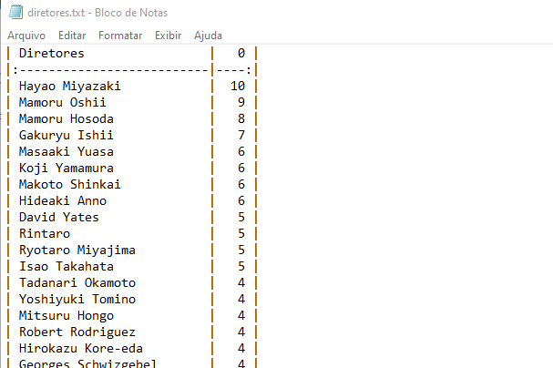

# Leterboxd My Directors

> Get the directors from your Letterboxd logs.

### Issues

O projeto ainda está em desenvolvimento e as próximas atualizações serão voltadas nas seguintes tarefas:

- [ ] Selenium sometimes get stuck while reading, just close chrome window and run diretores.py again, it will keep the progress and continues where it left off.
- [ ] Selenium handshake failed will keep showing but don't afect the process.

## 💻 Prerequisites

Before you begin, make sure you've met the following requirements:

- [Python](https://www.python.org/)
- [Selenium](https://pypi.org/project/selenium/)
- [Pandas](https://pypi.org/project/pandas/)

## ☕ Usage

-Import your data from https://letterboxd.com/settings/data/

-Put **diretores.py** and **i.txt** in same folder as ratings.csv

-Run **diretores.py**
